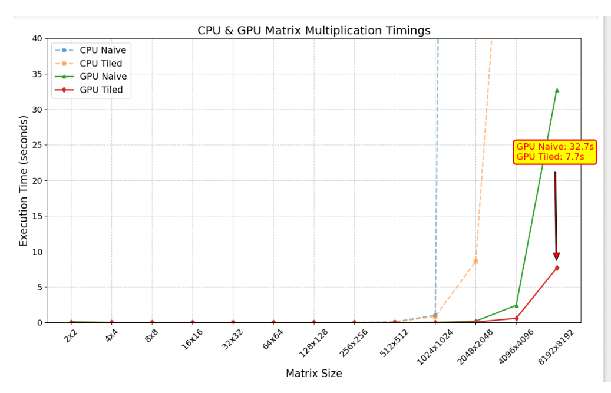

# GPU & CPU Matrix Multiplication — Research Observations

**Author:** Het Bhalala  
**Field:** GPU & AI 
**GPU Used:** NVIDIA GeForce MX350  
**Languages:** C, CUDA C/C++  
**Tools:** gcc, nvcc, Make

---

## 🎯 Project Objective

The goal of this experiment was to understand performance scaling and optimization techniques for **matrix multiplication** on both CPU and GPU architectures. I implemented and tested multiple versions — from a simple CPU baseline to optimized GPU kernels using shared memory and tiling — and measured the performance gains across different matrix sizes.

---

## ⚙️ Implementation Overview

### 🧩 CPU Implementations

- **Naive CPU Version:**  
  Implemented as a triple-nested loop performing standard `O(n³)` matrix multiplication. Each element of the output matrix `C` is calculated by iterating over the rows and columns of input matrices `A` and `B`.  
  *Drawback:* Poor cache locality causes the execution time to increase drastically with matrix size.

- **Optimized CPU Version (Tiled):**  
  Implemented using **block tiling** to improve cache reuse. This approach divides the matrix into smaller blocks that fit into cache, reducing cache misses and improving temporal locality.

  **Observation:**  
  Execution time reduced from approximately **5401 seconds** (naive) to **613 seconds** (optimized) for an **8192×8192** matrix — almost a **9× performance improvement**.

---

### ⚡ GPU Implementations

Two GPU versions were implemented using **CUDA C**:

1. **Naive GPU Kernel:**  
   Each thread computes one output element directly from global memory without any memory optimization. As the matrix size increases, global memory access latency becomes the performance bottleneck.

2. **Optimized GPU Kernel (Tiled with Shared Memory):**  
   Each thread block cooperatively loads submatrices (tiles) of `A` and `B` into **shared memory**. Computation is performed locally within the block, minimizing global memory reads.

   **Optimization Analysis:**  
   - Theoretical limits of MX350 GPU: 48 KB shared memory/block, 1024 threads/block, 4 bytes per element.
   - Optimal tile size `T=32` satisfies both hardware constraints and performance balance.
   - Shared memory usage per block: `2 × 32 × 32 × 4 = 8192 bytes` — well within the 48 KB limit.

   **Observation:**  
   The GPU tiled kernel reduced computation time for an **8192×8192** matrix from **32.7 seconds** (naive GPU) to **7.7 seconds**, a **4× improvement**.

---

## 📊 Experimental Observations

### 🧠 Key Takeaways

| Version | Method | Execution Time (8192×8192) | Speedup |
|----------|---------|-----------------------------|----------|
| CPU (Naive) | Triple-nested loop | 5401 s | Baseline |
| CPU (Tiled) | Cache-blocked algorithm | 613 s | **≈ 9×** |
| GPU (Naive) | Global memory only | 32.7 s | **≈ 166× vs CPU naive** |
| GPU (Tiled) | Shared memory tiles | 7.7 s | **≈ 4× vs GPU naive** |

---

## 🖥️ Graphical Results

Below are the performance trends captured during experimentation:

### CPU vs GPU Performance Graph


**Interpretation:**
- The **CPU tiled version** scales efficiently, while the naive CPU’s runtime grows exponentially with size.
- On GPU, **tile size = 32** achieves the best trade-off between shared memory usage and thread occupancy. Larger tiles (e.g., 64) are limited by shared memory capacity and thread block size.
- The tiled GPU kernel demonstrates clear efficiency improvements in memory access and overall runtime.

---

## 🧩 How to Build & Run

### Requirements
- CUDA Toolkit (version ≥ 11.0)
- C/C++ Compiler (gcc)
- NVIDIA GPU with CUDA support

### Compilation Commands
```bash
# CPU versions
gcc Simple_matrix.c -O2 -o cpu_naive
gcc optimized_matrix.c -O3 -o cpu_tiled

# GPU versions
nvcc GPU_navie_mul.cu -O3 -o gpu_naive
nvcc opt_GPU_matrix.cu -O3 -o gpu_tiled
```

### Execution
```bash
# Run CPU programs
./cpu_naive
./cpu_tiled

# Run GPU programs
./gpu_naive
./gpu_tiled
```

All output matrices are verified against CPU results. If mismatches occur, the program prints **“Verification Failed!”**; otherwise, **“Verification Success!”** confirms correctness.

---

## 💡 Conclusions

- Using **tiling and shared memory** dramatically reduces runtime by improving data reuse and reducing global memory traffic.
- The **tiled CPU version** achieves excellent cache performance.
- The **tiled GPU version** fully utilizes the MX350’s computational and memory resources with optimal occupancy.
- **Tile size 32×32** provides the best performance on this hardware configuration.

---

## 🔬 Additional Insights

If excess shared memory were available, I could further optimize by:
1. **Double-buffering** shared memory to overlap data transfer and computation.
2. **Register tiling** to store partial sums per thread, minimizing shared memory use.
3. **Multiple tiles per block** to increase computation reuse.

These enhancements would further reduce memory latency and increase arithmetic intensity.

---

**Overall, this project deepened my understanding of GPU memory hierarchies, thread scheduling, and the trade-offs between compute utilization and memory bandwidth. It marks a strong foundation for my career in GPU and AI systems engineering.**
